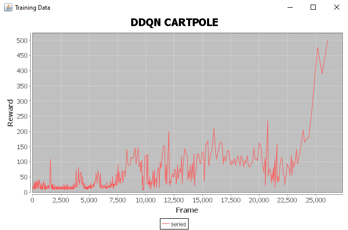

#ReinforcementLearning

DL4J comes with RL4J. But  the code is very dense java-esq production code that is hard for beginners to examine.
On top of that, python and tensorflow have been a moving target both migrating to 3.* and 2.* respectively since RL4J release

So I made a gym server fork and this repo to try some RL myself.

Easy cartpole experiments with no optimization
1) DDQN

2) Vanilla Policy gradient

3) Actor Critic

4) PPO

Other reinforcement learning summaries

Q Learning is a broad category of learning algos that return the value of the state or the state action
 Conceptually easier. Less likely to find local maxima. easily used in deterministic and discrete action environments.
Deep Q network DQN, Double Deep Q networks DDQN etc

On Policy algos return the best action without the concept of vlaue or reward.
Requires hand  crafted reward function. often combined with q network to overcome local maxima.
Easier implementation of stochastic and continuous return values can lead to better exploration
vanilla policy, actor critic, A2C, TRPO/PPO

Model based
